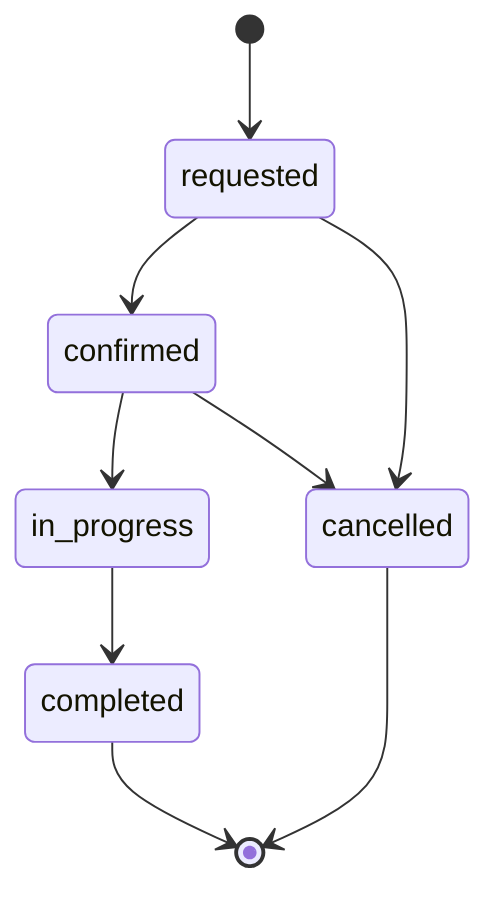

# Data Model: Gerenciamento de Locação de Veículo

Persistência nova e aditiva. Nomes de coluna novos em inglês. O JSON público está em [contracts/](./contracts/).

## Visão

```text
users 1 ──0..1── clientes 1 ──*── rentals *──1── carros
                                 │
                                 └── motivo, status, período, observação
```

`locacoes` continua ligada a `clientes` e `carros` pelo contrato `/api/v1` e não participa de `rentals`.

## users (existente, coluna nova)

| Coluna | Tipo | Regra |
|--------|------|--------|
| id, name, email, password, timestamps | já existentes | `email` único. O service grava e-mail em minúsculas nos fluxos novos. |
| role | string, not null, default `admin` | `renter` ou `admin`. Linhas já existentes ficam `admin`. |

O locatário novo nasce com `role = renter`. Senha com no mínimo 8 caracteres, apenas no cadastro, armazenada com o hash do Laravel. A senha não sai em resource nenhum. Esta feature não altera senha depois do cadastro e não cria usuário `admin`.

## clientes (existente, colunas novas)

| Coluna | Tipo | Regra |
|--------|------|--------|
| id, timestamps | já existentes | |
| nome | string, de 30 para 120 | Obrigatório no cadastro e na edição. |
| user_id | fk `users.id`, unique, nullable | Preenchido no autocadastro. Nulo em clientes legados sem conta. `restrict` no delete. |
| email | string, unique, nullable | Obrigatório no autocadastro. Único entre clientes. Igual ao `users.email` da mesma conta. Nulo em clientes legados. |
| phone | string(20), nullable | Obrigatório no autocadastro. Texto livre até 20 caracteres, sem máscara nesta versão. |

Um locatário autenticado altera só a linha cujo `user_id` é o dele. Nome, e-mail e telefone mudam na mesma transação que `users.name` e `users.email`. Locações já ligadas por `renter_id` permanecem.

Cliente legado sem `user_id` continua visível na lista administrativa (nome, e-mail e telefone, estes dois podendo ser nulos) e não entra por esta feature.

## carros, modelos, marcas (existentes, sem mudança de schema)

O catálogo já existe. Esta feature só lê `carros` com `modelo` e `marca` para a lista de disponíveis e para o detalhe da locação. Não cadastra, edita nem remove automóvel, marca ou modelo. `carros.disponivel` não define a vaga do período.

## rentals (nova)

| Coluna | Tipo | Regra |
|--------|------|--------|
| id | bigint | |
| renter_id | fk `clientes.id`, not null, index | Um locatário. `restrict` no delete. |
| vehicle_id | fk `carros.id`, not null, index | Um automóvel. `restrict` no delete. |
| starts_on | date, not null | Dia corrente ou futuro no fuso `America/Sao_Paulo`. Sem teto de antecedência. |
| day_count | smallint, not null | Inteiro de 1 a 90. |
| reason | string, not null | `trip`, `leisure` ou `everyday`. |
| comment | text, nullable | Opcional, no máximo 500 caracteres. Imutável depois do insert. |
| status | string, not null | Nasce `requested`. Ver transições. |
| admin_note | text, nullable | No máximo 500. Vazia apaga. Bloqueada em status final. |
| requested_on | date, not null, index | Dia corrente da operação no momento do insert. O cliente não envia. |
| timestamps | | |

Índice composto `(vehicle_id, starts_on, status)` para a consulta de sobreposição.

### Período

Fim exclusivo: `starts_on + day_count` dias.

Dia reservado: de `starts_on` inclusive até `starts_on + day_count - 1` inclusive.

Sobreposição entre duas locações que reservam:

```text
start_a < end_b  AND  start_b < end_a
```

Exemplo da spec:

- 1 dia em D ocupa `[D, D+1)`. Outra locação do mesmo automóvel começando em D+1 é aceita.
- 2 dias em D ocupam `[D, D+2)`. Locação começando em D+1 é recusada.

O locatário pode ter várias locações, inclusive sobrepostas, desde que cada automóvel esteja livre.

### Quem reserva

| status (código) | Reserva o automóvel |
|-----------------|---------------------|
| requested | sim |
| confirmed | sim |
| in_progress | sim |
| completed | não |
| cancelled | não |

### Transições



Qualquer outra passagem é recusada e o status anterior permanece. `completed` e `cancelled` também recusam mudança de `admin_note`.

A criação grava somente `requested`. O locatário não altera `reason`, `vehicle_id`, `starts_on`, `day_count`, `comment`, `status` nem `admin_note`.

## Regras por serviço

### RenterAccountService

- Cria `users` + `clientes` numa transação.
- Recusa e-mail já usado em `users` ou `clientes`, inclusive na troca de e-mail do próprio perfil.
- Recusa atualização quando o ator não é o `user_id` da linha.
- Não altera senha, papel nem locações.

### RentalService

- Lista automóveis sem reserva sobreposta para o intervalo pedido. Data passada, dia ausente ou quantidade fora de 1..90 não produz lista de solicitação válida.
- Cria a locação só para ator `renter`, depois do lock do automóvel e da releitura das reservas.
- Lista e detalhe do locatário filtram `renter_id` do ator. Id de outro locatário, ou id inexistente, é `not_found` e não devolve campos da locação.
- Lista de todos os locatários, lista de todas as locações, detalhe administrativo e quantidade do dia exigem ator `admin`.
- Quantidade do dia: `count` de `rentals` com `requested_on` igual ao dia corrente no fuso da operação. Inclui qualquer status e qualquer `starts_on`. Exclui `requested_on` de outros dias, mesmo que o período cubra hoje. Zero quando não houver linha.
- Atualização administrativa aceita `status`, `admin_note`, ou os dois. Transição ilegal ou registro final aborta a transação inteira.

## O que esta versão não persiste

Documento de identidade, habilitação, endereço, nascimento, recuperação de senha, preço, caução, quilometragem, multa, devolução antecipada e busca por nome, e-mail ou automóvel.
